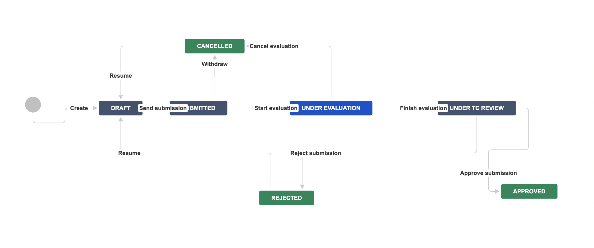

# New Module Technical Evaluation Process JIRA Workflow

## Overview
This document outlines the JIRA Project and Workflow used by the New Module Technical Evaluation Process.

### JIRA Project information
* The project where New Module Technical Evaluation submissions should be created is called [Technical Council Requests](https://issues.folio.org/projects/TCR).
* The only available issue type and one that should be used for submissions is "Task".

## JIRA Workflow

**DRAFT** Initial status for newly created submissions.

**SUBMITTED** Once the submission is ready for the TC review, the submitter transitions the issue to this state.

**UNDER EVALUATION** Once the submission is reviewed by the TC and an evaluation group is formed, the TC indicates this by transitioning the issue to this state.

**CANCELLED** If the submitter decides to withdraw the submission (alone or together with the evaluation group), he/she transitions the issue to this state.
The submission may be resubmitted at a later time.

**UNDER TC REVIEW** Once the evaluation is complete, the evaluation group communicates the results and transitions the issue to this state.

**APPROVED** Once the evaluation results are reviewed by the TC and the submission is approved, the TC transitions the issue to this state.

**REJECTED** Once the evaluation results are reviewed by the TC and the submission is rejected, the TC transitions the issue to this state. 
The submitter may resubmit the submission once the failed criteria are addressed.
